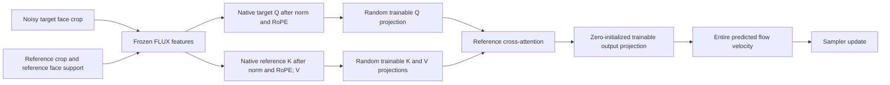

# BA-only face reconstruction from noise

This remains a reconstruction control, not validation of the user's prompted
generation task. The corrected experiment uses native prompted backgrounds,
generated-image face masks and BA face flow: [MASKED_FACE_FLOW.md](MASKED_FACE_FLOW.md).

**Retained result:** the direct-velocity variant below turns initial texture
into detected faces on four of four fixed seeds after training. It uses one BA
layer plus learned query/noisy-latent paths; the native FLUX velocity is disabled.
Use `scripts/run_face_crop_flow.sh` for this variant. The pure-read architecture
and subsequent controls below document how the retained variant was selected.

The user clarified that the face should begin near random and become usable
through BA training. A zero residual added to native FLUX does not create that
test: the native model already draws a face. This named experiment therefore
disables the native velocity prediction for an entire 256×256 face crop.

The initial pure-read network is one reference cross-attention layer with four heads
and width 256. Its Q/K/V projections are randomly initialized and its final
256→128 velocity projection is exactly zero. There is no native velocity sum,
query residual, learned face router, auxiliary mask loss, or trainable native
backbone parameter. Initially the sampler leaves its Gaussian latent unchanged.

The frozen backbone remains a pretrained feature extractor, including native
reference conditioning within its hidden features. This is a BA-only **output**
diagnostic, not a randomly initialized entire image model or proof that all
identity information travels exclusively through the added attention read.
Source seam: `ba_dit/nn/face_crop_flow.py`. Runner:
`scripts/face_crop_flow.py`. The existing residual BA paths are unchanged.

Training uses the first four target crops from the existing one-ID dataset,
one shared reference crop, six fixed noise levels, two fitted noise seeds and
one separate probe seed. All are identity 51; repeated/related source photos
are permitted in this explicit reconstruction diagnostic. Only the unweighted
native flow MSE is optimized, for 2,000 updates with batch eight. Feature caches
are exact frozen inputs; reported optimizer speed excludes feature extraction.

The four-sample generation panel uses a constant close-up prompt and seeds
0–3, at 0/1,000/2,000 updates, 256 px, 20 steps and CFG 1. This is separate
from the earlier 24-image full-scene panel. No target or generated-face mask
enters inference. Evaluation ownership is the whole predefined crop canvas.

Required evidence: finite gradients, Q/K/V updates following the first output
update, save and fresh-process resume parity, exact cached/fresh pretrained
features and BA predictions, held-noise flow loss, images from pure noise and
the existing ID/CLIP scorers. Reduced loss alone does not establish recognizable
face generation or identity generalization. Zero reference values force the
bias-free BA prediction back to zero; this checks reference dependence but not
identity selection across different people.

Run: `runs/flux4b_ba_only_face_crop_20261001`.
[Comet](https://www.comet.com/nikolay-2104/rsrch-new/124f6e2825674ab68e0f7a41a2d41a68).
The pure-read run completed all 2,000 updates and 0/1,000/2,000 validation.
Fit MSE fell 1.95517→1.43735 (26.5%); separate-noise MSE fell
1.95073→1.48874 (23.7%). The trained images show face structure but remain
strongly speckled, and the detector finds no faces in any of the four seeds at
any checkpoint. Thus this version learns but does not demonstrate usable face
reconstruction. Its evidence and source snapshots are retained.

Caching the 72 cases took 10.07 seconds with 7.527 GiB peak CUDA reservation.
The 2,000 head updates took 10.93 seconds of optimizer time with 0.461 GiB peak
reservation. Fresh-process resume at step 51 was bit-exact, all gradients were
finite, and six fitted/probe cached-versus-full predictions were bit-exact.
These timings exclude model loading, inference, scoring and Comet uploads.
The very fast per-step Comet stream was throttled; full metrics remain in
`metrics.jsonl`. Subsequent live logging samples every 25 steps and uploads the
complete metric file as an asset.

## Query-residual follow-up

The pure reference mixture leaves much of the target noise unexplained. A
second named trial adds the standard projected-query residual **inside BA**:
`velocity = output(query_projection + reference_attention)`. The native FLUX
velocity remains disabled and the output projection still starts at zero.
The parameter count is unchanged at 2,392,064. Data, noise, order, optimizer,
2,000 updates and generation seeds/settings match the pure-read control.

This variant additionally measures flow error with its reference read switched
off. That distinguishes learning in the added attention read from learning
only through its query path. Run:
`runs/flux4b_ba_only_face_crop_query_20261001`.

The query-residual trial completed: fit MSE 0.95208 (51.3% reduction),
separate-noise MSE 1.19463 (38.8% reduction). Disabling the reference read
worsens probe MSE to 1.37822, so the read contributes. Nevertheless all four
trained crops remain speckled and no face is detected at either checkpoint.

## Learned noisy-latent projection

A third controlled variant supplies the actual noisy target latent to a small
learned projection within BA, rather than requiring normalized/rotated native
queries to retain all the noise information. It removes the query residual and
predicts `velocity = (W_noise(x_t) + W_out(reference_attention)) / sigma`.
Both output projections start at zero, so the initial image remains noise;
Q/K/V are random, and every trained parameter remains inside BA. There is no
hardcoded identity matrix, native velocity prediction, or inference target mask.
The timestep factor is the standard relation between clean-latent and flow
parameterizations. The native flow MSE, data, update count and panel are held
fixed. Run: `runs/flux4b_ba_only_face_crop_noise_20261001`.

At learning rate 0.002 this scaled version was unstable despite finite
gradients: final fit/probe MSE rose to 7.706/7.738, above the zero-flow baseline.
It is retained as a failed trial. A 1,000-update cached check found that lowering
the scaled learning rate to 0.0001 or 0.00002 stabilizes it, but removing timestep
division gave lower probe loss. Trial records are `stability_trials.json` in
that run; these are cached training checks, not additional image validation.

The final direct-velocity trial combines the BA query residual and learned
noisy-latent projection without timestep division:

`velocity = W_out(Q_branch + attention(Q_branch,K_branch,V_branch)) + W_noise(x_t)`.

Both W_out and W_noise start at zero. There is one attention layer, 2,408,448
trainable BA parameters, no native velocity, no target mask and no auxiliary
loss. A 2,000-update cached check reached fit MSE 0.6492 and separate-noise MSE
0.8107; removing the reference read raises probe MSE to 1.0811. The named fresh
run and full pretrained inference are
`runs/flux4b_ba_only_face_crop_direct_20261001`,
[Comet](https://www.comet.com/nikolay-2104/rsrch-new/29b7730044c94c2c97b736d27ae442e0).
## Completed direct-velocity result

All four fixed seeds changed from pure texture to recognizable, detected faces.
The images are still rough and do not establish production image quality.

| Update | Detected faces | ID similarity | CLIP |
| ---: | ---: | ---: | ---: |
| 0 | 0/4 | 0 (no face detected) | 17.3180 |
| 1,000 | 4/4 | 0.30705 | 22.6772 |
| 2,000 | 4/4 | 0.30599 | 22.0813 |

The actual resumed run ends at fit MSE 0.64709 (66.9% reduction) and separate
noise MSE 0.80629 (58.7% reduction). The probe uses the same four crops with
new noise, not unseen people or photographs. Removing the added reference read
raises probe MSE to 1.06299 (31.8% above the full head). In a same-seed generation
control, seed-zero identity similarity falls 0.39975→0.27812 with the read off.
The read-off image still contains a coarse face: pretrained query features and
the learned query/noise paths also contribute. This is evidence for the added
attention read's contribution, not exclusive identity transport through it.

All five BA parameter tensors changed and remain finite; all 2,000 loss/gradient
records are finite. Both output projections were exactly zero at initialization.
Fresh-process resume at step 51 is bit-exact. Six fresh-backbone/cached BA
predictions, covering fit/probe cases at all three checkpoints, match exactly.
Peak CUDA reservation was 7.527 GiB for the frozen backbone and 0.461 GiB during
cached head training. Optimizer time was 11.10 seconds; the complete primary run
through image scoring/report generation took 182.25 seconds (about 3 minutes).
These cached-input timings do not describe fresh-noise end-to-end training.

Use `bash scripts/run_face_crop_flow.sh runs/NEW_NAME` to repeat this variant.
The main run contains `comparison.png`, `report.md`, `final_audit.json`, full
`metrics.jsonl`, source snapshots and checkpoints. The focused ablation runner
is `scripts/ablate_face_crop_flow.py`; its image and scores are retained in
`reference_read_off/`. All four trials retain their negative or positive
results, configurations and source snapshots. No Vast host or Git push was used.

Source snapshots now preserve repository-relative paths, avoiding a collision
between the runner and module basenames. Exact executed sources for all four
runs were recovered and verified against their recorded SHA256 hashes. This
post-run storage fix changes no training or inference computation. Reopening
an existing run requires its executed sources for strict provenance checking;
fresh runs use the corrected snapshot layout.
